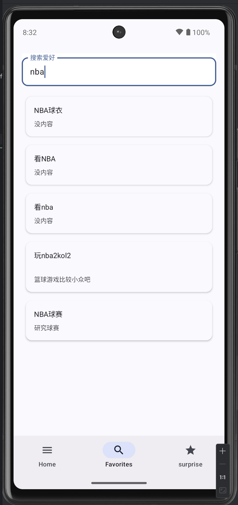

# HobbyExplorer

HobbyExplorer 是一个 Android 应用，旨在帮助用户发现和管理他们的爱好。用户可以查看、搜索和添加新的爱好，并可以点击查看每个爱好的详细信息。

## 目的

该应用的主要目的是为用户提供一个平台，方便他们记录和管理他们的爱好信息。通过该应用，用户可以：
- 浏览所有记录的爱好。
- 搜索特定的爱好。
- 查看每个爱好的详细信息，包括基本介绍、时间成本、爱好开支等。
- 随机显示一些爱好，帮助用户发现新的兴趣。

## 技术栈

HobbyExplorer 使用了以下技术和工具：
- **Kotlin**：主要编程语言。
- **Jetpack Compose**：用于构建声明式 UI。
- **Room**：用于本地数据库管理，存储和检索爱好数据。
- **Navigation Component**：用于处理应用内的导航。
- **ViewModel 和 LiveData**：用于管理 UI 相关数据，实现数据驱动的接口。
- **Material3**：用于设计和实现现代用户界面。
- **Coroutine**：用于异步操作和后台任务处理。

## 功能

- **浏览爱好**：用户可以查看所有记录的爱好的列表。

- **搜索爱好**：用户可以在搜索栏中输入关键词，找到特定的爱好。

- **查看详情**：点击任何爱好，查看其详情。

- **随机显示**：随机显示一些爱好，帮助用户发现新的兴趣。

- **返回功能**：用户可以使用返回按钮返回到上一页。

## 截图

